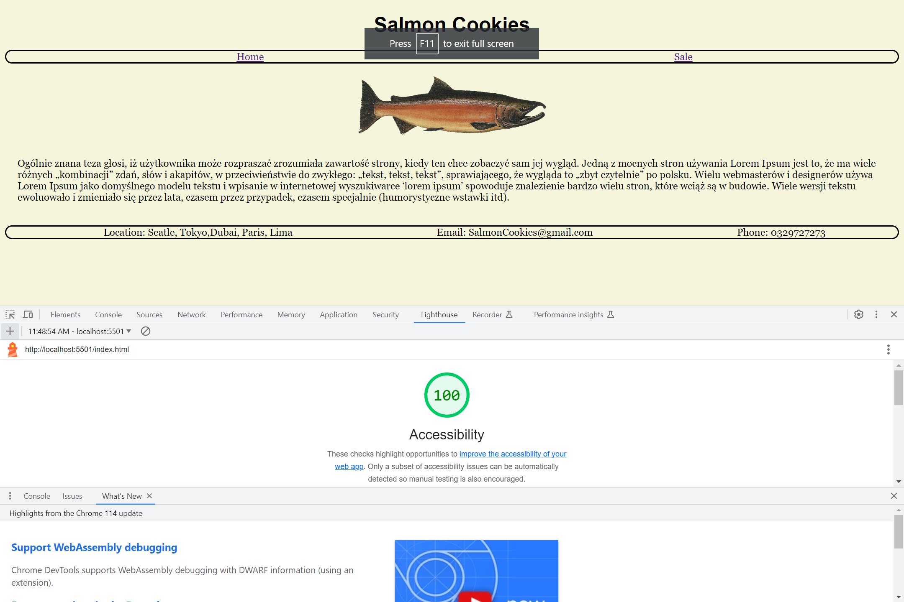

# Cookie-stand2

## Sale Data

- [x] Before you begin, create a new repository within GitHub called “cookie-stand”. Make sure that this repository is properly set up with a license and a readme. Clone this repo down to your local machine.

- [x] Create two new pages within your project. One for Sales Data (sales.html) and another for the homepage (index.html). You’ll also need to create at least one JavaScript file. Example: app.js.

* Within your javascript file, create separate JS object literals for each shop location. Each location will be responsible for generating sales data and providing output on an html document. You should be able to perform the following tasks in your javascript file:

- [x] Store the min/max hourly customers, and the average cookies per customer, in object properties.
- [x] Use a method of that object to generate a random number of customers per hour. Objects/Math/random
- [x] Calculate and store the simulated amounts of cookies purchased for each hour at each location using average cookies purchased and the random number of customers generated.
- [x] Store the results for each location in a separate array… perhaps as a property of the object representing that location.
- [x] Display the values of each array as unordered lists in the browser.
- [x] Calculating the sum of these hourly totals; your output for each location should look like.

* Here are the starting numbers that you’ll need to build these objects:

Location	Min / Cust	Max / Cust	Avg Cookie / Sale
Seattle	23	65	6.3
Tokyo	3	24	1.2
Dubai	11	38	3.7
Paris	20	38	2.3
Lima	2	16	4.6

## Home Page

- [x] A custom sans-serif Google Font for use in heading tags (<h# />)
- [x] A specified standard sans-serif web font for sales data (such as Arial, Verdana, or Helvetica).
- [x]] A specified standard serif web font for text (such as Georgia, Times).
Specified different font colors for all three font uses.
- [x] A background color for the default page background (make sure font colors have good contrast and are readable on this background).
- [ ] A different background color for elements such boxes and tables (so make sure the font colors contrast against this well, too!).
- [x] Anything else you’d like to add related to style. But remember: simplicity, clarity, and consistency are good things in design.
- [x] Be thoughtful about layout and overall organization of the page.
- [x] Run a Lighthouse Accessibility report. In this module, push to achieve a score between 65-80.
- [100] Lighthouse Accessibility report.

- [x] Add the screenshot of your score to your README.md.
- [x] Include all of the typical stuff that you’ll find on the home page of a business: locations, hours, contact information, some text about how awesome the business is, etc. Be creative, and again, think about what is meaningful to a typical end user.

## Developer Style Guide
- [x] In addition to the requirements listed above, please ensure that your project also contains the following according to our style guide:

- [x]  For every lab within this project, you will be creating a new branch for every day. Create a new branch name that follows the following format class##-feature (example: class06-Objects).

- [x] Within your local version of your repo, add your .gitignore and .eslintrc.json.

- [x] While working within your non-main branch, conduct regular commits within git.

- [x] All properties/values and methods should be correctly constructed and given meaningful names.

- [x] Functions and methods should follow the single-responsibility principle.

- [x] Use template literals in your JS logic to render the stores as lists on the sales page.